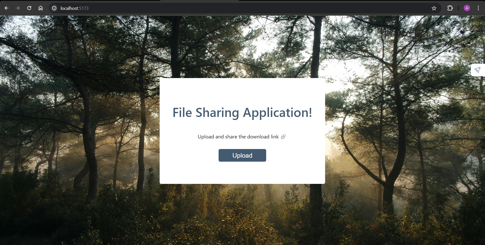
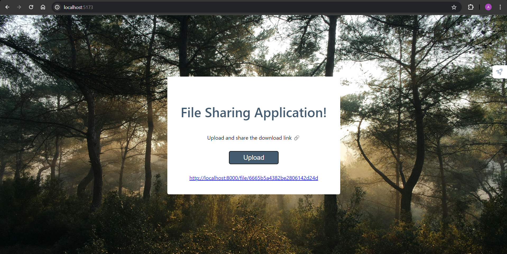
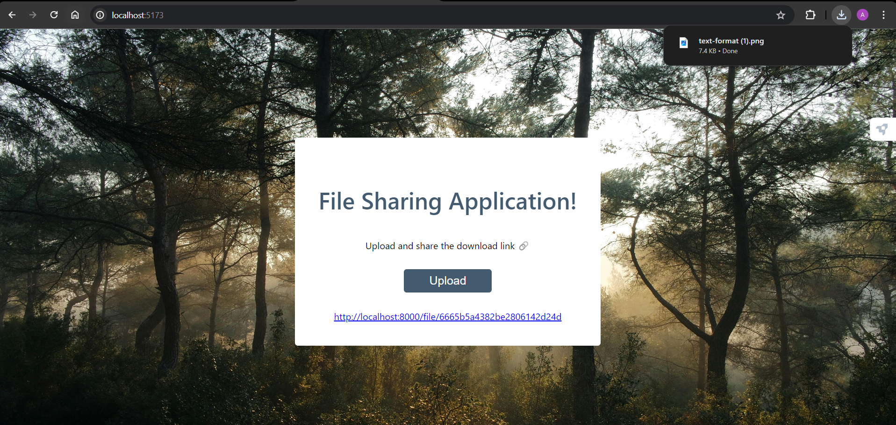

<h2 align ="center">File Sharing Application</h2>
File-Sharing Application, a user-friendly platform that allows you to effortlessly upload files and share them via unique download links. This application is perfect for anyone who needs a quick and easy way to share files.

<h2>ScreenShots</h2>

### File Sharing Application:
<table>
        <tr> 
        <td></td>
        </tr>
</table>

### Generate link:

<table>
        <tr> 
        <td></td>
        </tr>
</table>

### Downlaod File from Link:

<table>
        <tr> 
        <td></td>
        </tr>
</table>

### Features
* **Simple Upload:** Easily upload files from your local storage.
* **Instant Links:** Generate unique, shareable download links for each file.
* **Easy Access:** Download files directly using the provided links.
  
### Technologies Used

- [x] Frontend: React.js
- [x] Backend: Node.js, Express.js
- [x] Database: MongoDB
